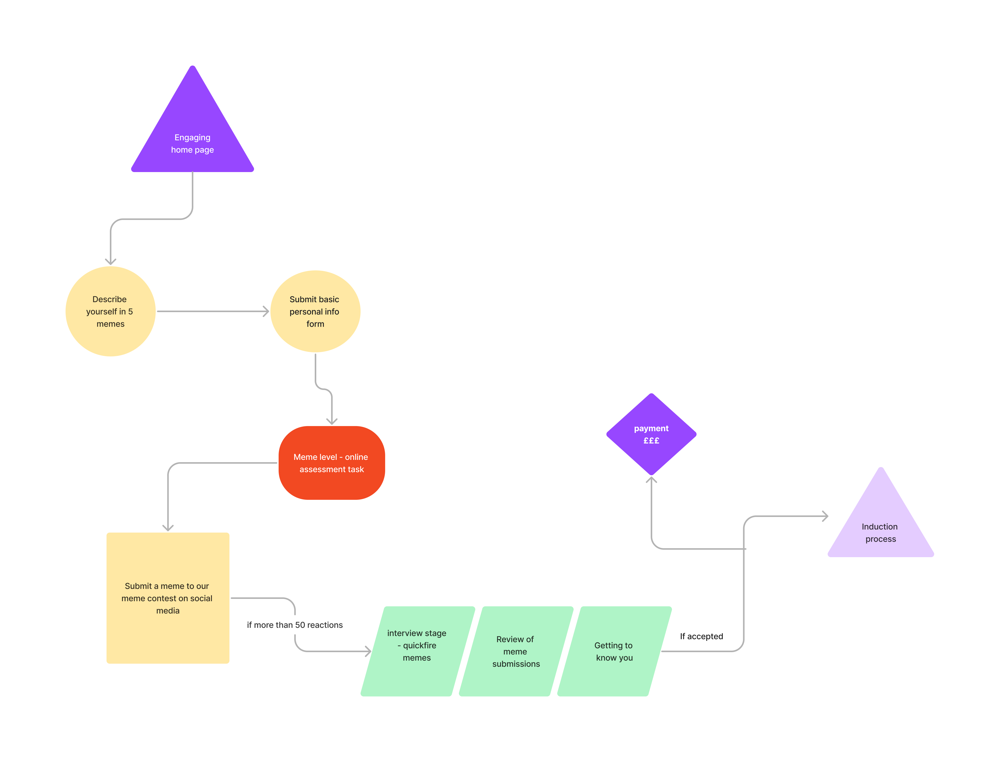
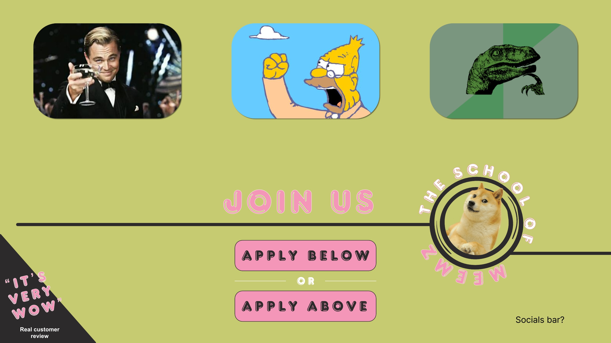
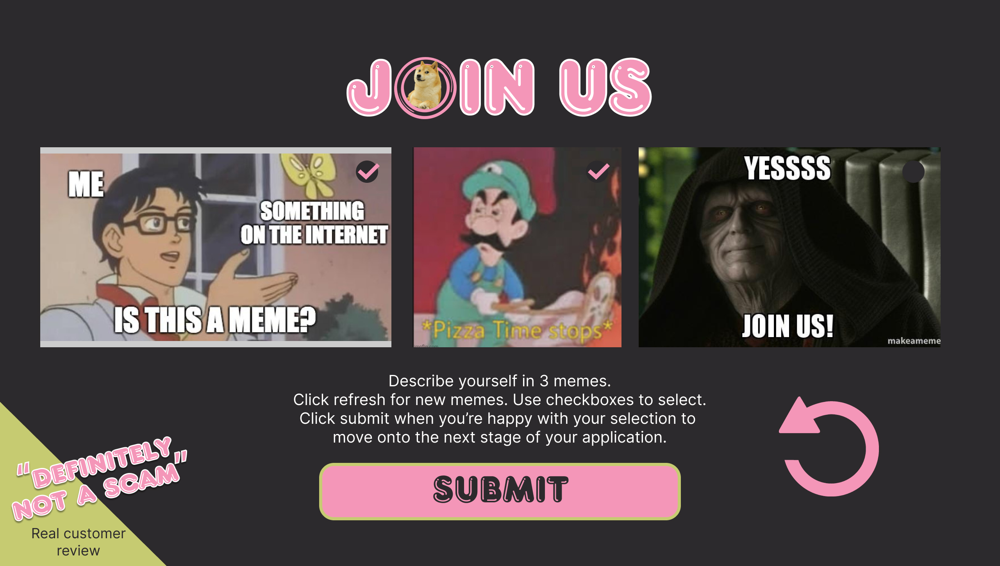
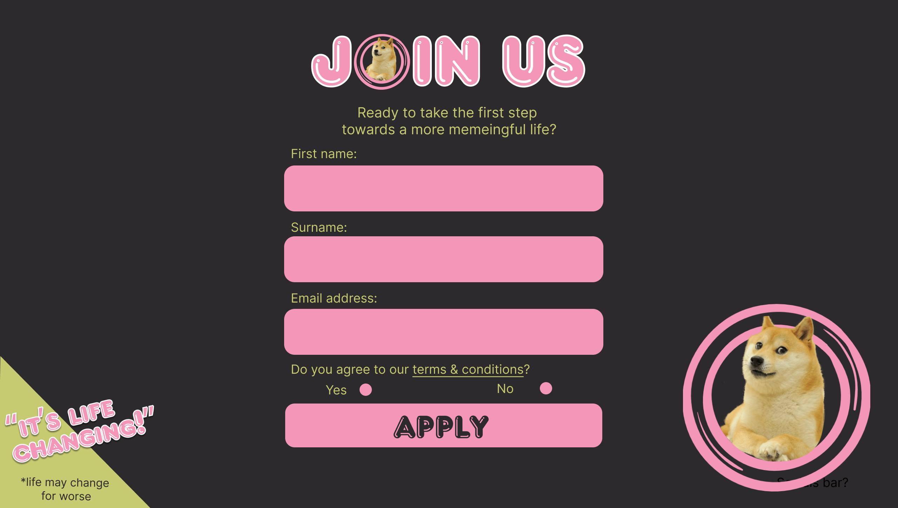

**SCHOOL OF MEEMZ**

A week-long team exercise with Lani Irving and Ben Lloyd. Strangely enough, my main contribution on this was the graphic deisgn. 

It started as a joke, but then we had to own up to it. One big design challenge was to take the playful aspect seriously. Hence the colours and the double button on the landing page, (with both buttons taking the user to the same place--the second, meme-submission page). And only after the user has already interacted in a meaningful way with the matter at hand, are they asked to give provide personal info and sign in, on the third page.

Ideally the meme submission page would have had an app similar to a meme making site behind it, but as such we had to make do with requesting random meme templates from an API. Once the user would find one to their liking, they would add text to it (probably though a separate input field) to create the meme, and lock it by using the checkbox corresponding to each image. Then they would repeat the process for the remaining slots. Maybe not the ideal solution, but still a great technical achievement from our part :)

One of the many intriguing things from this week has been the SVG prototype, which can function as a fully-formatted web page without any CSS. 

 **THE USER JOURNEY**
 

 **LANDING PAGE**
 

 **ENGAGEMENT PAGE**
 

**SUBMISSION PAGE**
 