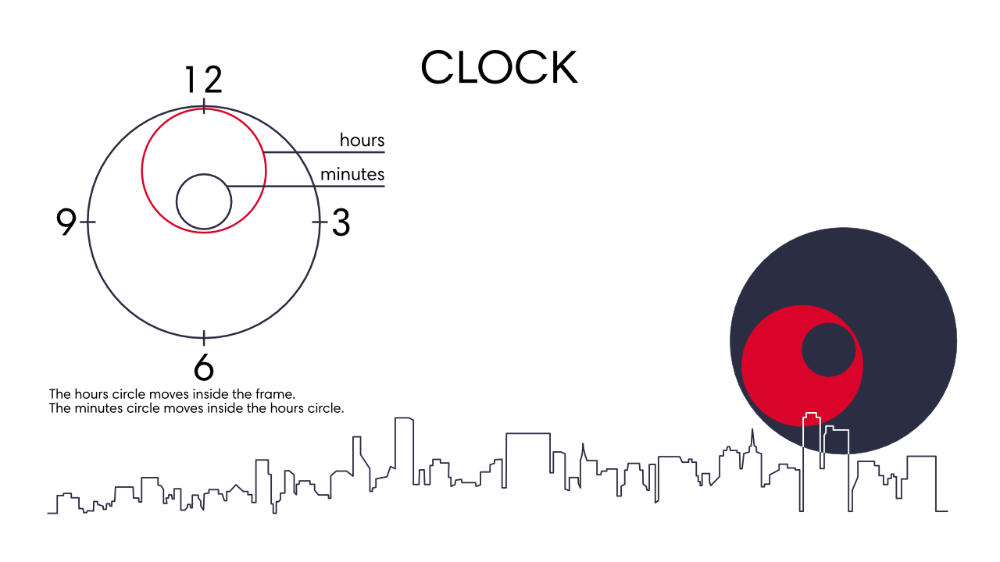
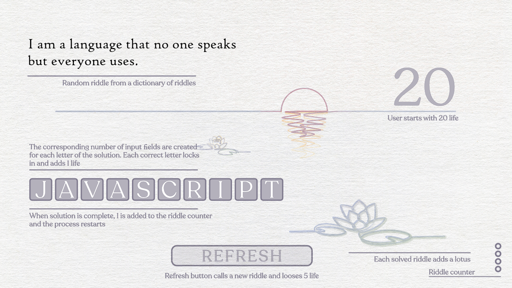
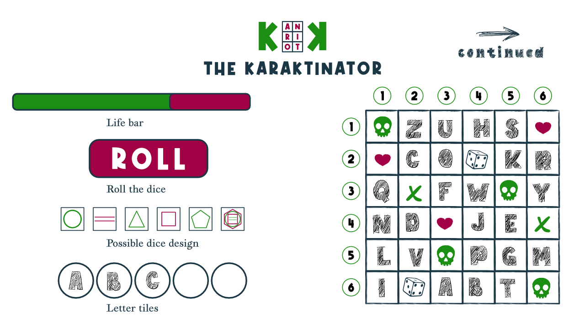
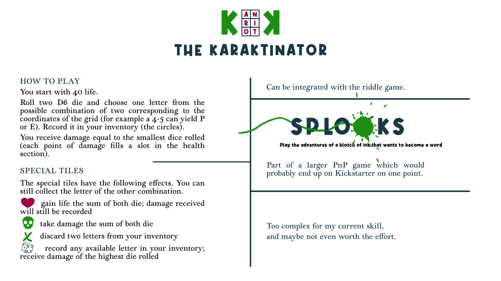

**PROTOTYPES**

In my experience, the best way to learn is to put to work your newly acquired (or yet to be acquired) knowledge to the things you like, the stuff you kept thinking about for a while now, stuff you may have already started doing in one form or another, and which may already have a degree of familiarity to you. 
So I've set up the following prototypes as continuations and digitisation attempts of some of [my ongoing projects](https://www.artifices.xyz/) (though them too are in a prototype phase).

**THE SWANKY CLOCK PROJECT**
I mean look at it. Pretty glonky, wouldn't you say? Though it will definitely strain my CSS skills.
 

**THE PATH OF RIDDLES**
This is a continuation of my [long affair with riddles](https://www.artifices.xyz/the-curious-story). Ever since I started my riddles project, I keep apologising for it, and will continue to do so--yes, riddles may be boring in 2020, but I believe [there's something about them](https://www.artifices.xyz/a/an-artificer-s-history-of-riddles). 
 

**THE KARAKTINATOR**
A mini game inside a larger PnP game. I have already used a version of it as one of the five games in [The Onward Path](https://www.artifices.xyz/onward-path).

  